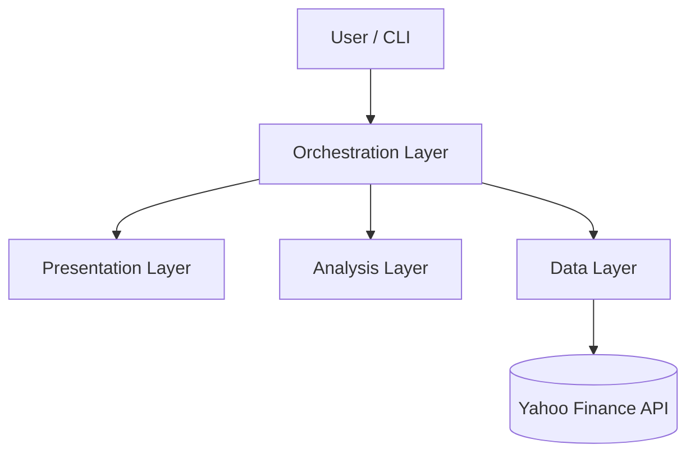

# High-Level Design (HLD): Financial Analysis Application

## 1. System Overview
The Financial Analysis Application is an automated, tightly-coupled object-oriented Python software designed to expedite stock market research. It enables users to scan baskets of stocks, deep-dive into singular assets compared to peers, review existing portfolio risk distributions, and **optimize portfolio allocations using Modern Portfolio Theory (MPT)**. By systematically abstracting data fetching, algorithmic analysis, and reporting, the platform aims to be highly robust and inherently extensible for algorithmic trading or machine learning injection.

## 2. Architectural Paradigm
The system strictly enforces the **SOLID design principles**, primarily relying on the **Single Responsibility Principle (SRP)** and the **Dependency Inversion Principle (DIP)**. 

The application is structured via a **4-Tier Layered Architecture**:

### 2.1. Orchestration Layer (`market_scanner.py`, `asset_profiler.py`, `portfolio_optimizer.py`)
Acts as the controller mechanisms. It binds the Data, Analysis, and Presentation layers together to execute distinct execution pipelines. By splitting the orchestrators into three standalone scripts, we ensure that specific UI pathways are loosely coupled. The `portfolio_optimizer.py` orchestrator supports both legacy risk analysis and MPT-based optimization with Efficient Frontier computation.

### 2.2. Presentation Layer (`reporting.py`)
Responsible purely for formatting and drawing. 
- Receives quantitative outputs from the Analysis Layer.
- Employs Plotly to render HTML-based, interactive Japanese Candlestick and MACD charts.
- Renders interactive Efficient Frontier charts annotated with Max Sharpe, Min Variance, individual assets, and optional current portfolio markers.
- Parses qualitative data to construct CLI reporting text.

### 2.3. Analysis Layer (`analyzers.py`, `mpt_engine.py`)
The functional core where financial mathematics and heuristic logic securely reside. This layer consumes raw timeseries matrices and dictionary metadata to compute domain-specific formulas. The `mpt_engine.py` module is a pure-math submodule containing Modern Portfolio Theory computations (returns, covariance, `scipy.optimize` constrained optimization, Efficient Frontier generation) with zero side effects, enabling high testability and reuse.

### 2.4. Data Layer (`data_provider.py`)
The boundary edge interface interacting with WAN resources (YFinance). Handles rate limiting, missing data points, and serialization into native `pandas` DataFrames.

## 3. Core Design Patterns

### 3.1. Strategy Pattern
Employed across the Analysis Layer. All analyzers (Technical, Fundamental, Portfolio, EfficientFrontier) implement a unified `BaseAnalyzer` explicit interface map. The orchestrator delegates analysis to these objects dynamically without knowing their deeply complex inner mathematics. The `EfficientFrontierAnalyzer` delegates computation to the pure-function `mpt_engine` module, mirroring how `TechnicalAnalyzer` delegates to the `ta` library.

### 3.2. Provider (Adapter) Pattern
The `MarketDataProvider` acts as an Abstract Base Class. `YFinanceProvider` adapts the Yahoo Finance endpoints to our strict internal dataframe schemas, protecting the core application from upstream structural changes.

## 4. Workloads & Data Flow
A standard pipeline (e.g., Asset Profiler) operates sequentially:
1. **Request**: Orchestrator receives target `Ticker` and `Peers` from user arguments.
2. **Fetch**: Orchestrator queries `YFinanceProvider` for historical OHLCV data and JSON fundamental info.
3. **Execute**: Data payloads are passed to instantiated Analyzer objects via their explicit `run(data)` methods.
4. **Aggregate**: Output dictionaries containing indicator states (e.g. `{'MACD_hist': 1.25, 'RSI': 34.5}`) are returned to the Orchestrator.
5. **Render**: Orchestrator passes these payloads to the `Visualizer` to generate network-local HTML charts and the `RecommendationEngine` to output standard out text.

## 5. Security & System Boundaries
- **Stateless Execution**: The engine does not store user data, API keys, or intermediate analysis metrics to disk, effectively neutralizing state-based corruption or filesystem bloat constraints.
- **Upstream Boundaries**: Handled strictly within `YFinanceProvider`. Faults originating from YFinance are caught and safely bubbled as Python warnings to skip unanalyzable assets rather than causing fatal tracebacks.
